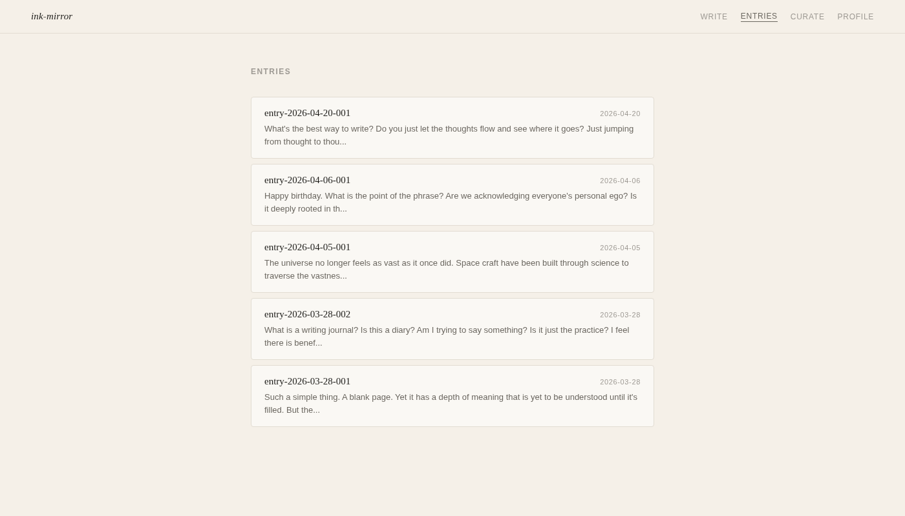
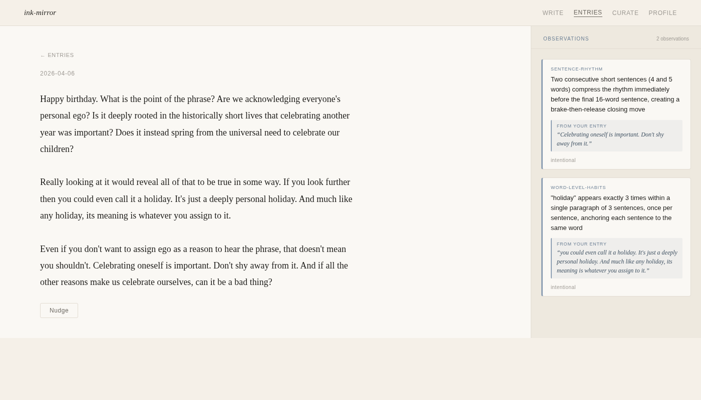
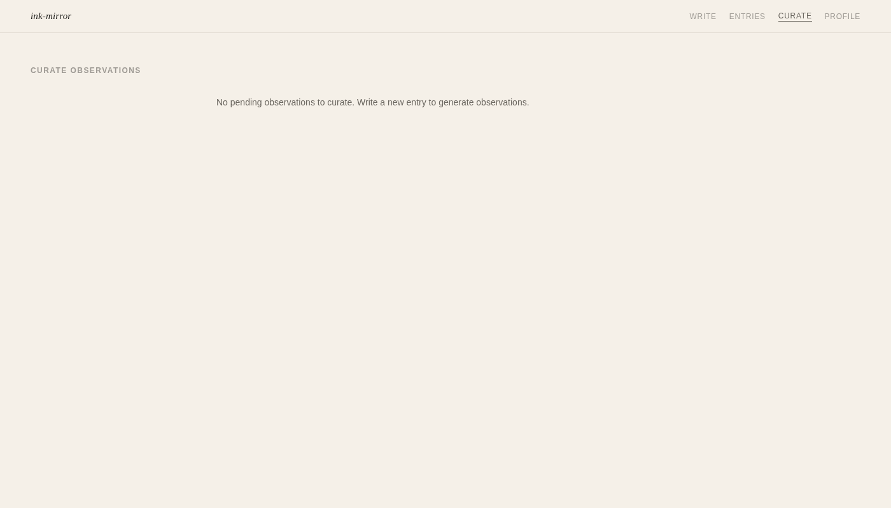
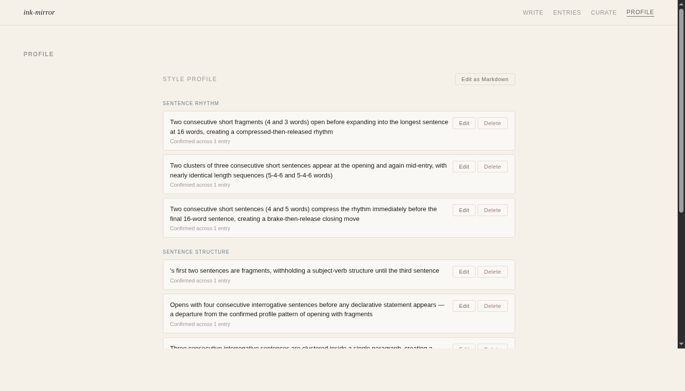

# ink-mirror — Usage Guide

ink-mirror is a writing self-awareness tool. It watches your journal entries, identifies patterns in how you write, and reflects them back to you. It never generates text or corrects you — it only observes. Over time you build a style profile that describes how you actually write, not how you think you do.

---

## How it works

The core loop is three steps:

1. **Write** — journal entries in the editor
2. **Observe** — the system automatically generates observations about your writing patterns after each submission
3. **Curate** — review observations and decide which patterns are intentional (goes into your profile) vs. accidental (discarded)

After a few sessions, your profile contains confirmed patterns about your sentence rhythm, word habits, and sentence structure — all derived from your actual writing.

---

## Pages

### Write

`/write` — the default landing page.


The editor is a full-page textarea. The date is shown at the top. The word count updates as you type.

**Bottom bar:**
- **Nudge** — runs a craft analysis on what you've written (see [Craft Nudges](#craft-nudges) below)
- **Observe →** — submits the entry; the daemon generates observations and streams them back in real time

When you click **Observe →**, the button changes to "Observing..." and observations appear as they're generated. Once complete the page redirects to the new entry's detail page.

---

### Entries

`/entries` — a list of all submitted entries, newest first.



Each row shows the entry ID, date, and a short preview of the text. Click any row to open the entry.

---

### Entry Detail

`/entries/:id` — the full entry with its observations in a side panel.



The left side shows the full entry text with a **Nudge** button at the bottom. The right panel shows all observations generated for that entry, grouped by dimension:

- **Sentence Rhythm** — patterns in sentence length, pacing, clustering
- **Word-Level Habits** — hedging, intensifiers, repeated words, nominalizations
- **Sentence Structure** — active/passive ratio, fragments, interrogatives, opener patterns

Each observation includes:
- A description of the pattern
- A direct quote from your entry (the evidence)
- A status badge: `pending`, `intentional`, `accidental`, or `undecided`

---

### Curate

`/curate` — a review session for pending observations.



When there are pending observations, this page presents each one with the full entry text for context. For each observation you choose:

- **Intentional** — this is how I write on purpose; add it to my profile
- **Accidental** — not intentional; discard it
- **Undecided** — skip for now; it will resurface in the next session

When you mark an observation as **Intentional**, the profile updates automatically. If the new pattern conflicts with an existing confirmed rule, a contradiction warning is shown so you can decide which one to keep.

---

### Profile

`/profile` — your accumulated style profile.



Rules are grouped into three dimensions:

| Dimension | What it tracks |
|-----------|---------------|
| **Sentence Rhythm** | Length patterns, pacing, how you open and close |
| **Sentence Structure** | Fragment use, question/statement balance, opener types |
| **Word-Level Habits** | Recurring words, hedging language, repetition |

Each rule shows how many entries confirmed it. You can **Edit** a rule inline to rephrase it, or **Delete** it to remove it from your profile.

**Edit as Markdown** switches to a raw markdown editor for bulk edits — useful for rephrasing multiple rules at once, reorganizing, or adding context that the structured view doesn't support.

---

## Craft Nudges

The **Nudge** button (on the write page and entry detail) runs a separate analysis against 12 craft principles — not against your personal patterns, but against general writing craft. It identifies things like:

- Passive voice clustering
- Sentence monotony (uniform length throughout)
- Hedging accumulation ("somewhat," "perhaps," "might")
- Nominalization density (turning verbs into nouns)
- Buried lead
- Unclear antecedents
- Characters buried in dependent clauses

Each nudge returns:
- The **craft principle** it's about
- **Evidence** — the exact text from your entry
- An **observation** — what the pattern looks like (descriptive, not prescriptive)
- A **question** — open-ended, Socratic; at least one reading where the pattern is legitimate

Nudges never suggest rewrites or tell you something is wrong. They make patterns visible so you can decide whether they're serving you.

---

## CLI

The CLI provides the same core features without the browser. It discovers available commands from the daemon at startup.

```bash
# Submit an entry using $EDITOR
ink-mirror write

# Interactive curation session in the terminal
ink-mirror curate

# Show your current style profile
ink-mirror profile

# Open profile in $EDITOR for editing
ink-mirror profile edit

# List all entries
ink-mirror list

# Show a specific entry
ink-mirror show <entry-id>
```

The curation session prompts `(i)ntentional / (a)ccidental / (u)ndecided / (s)kip` for each pending observation and prints a summary when done.

---

## Your data

All data lives in `~/.ink-mirror/`:

```
~/.ink-mirror/
  entries/          # one markdown file per entry
  observations/     # one JSON file per observation
  profile.md        # your style profile (markdown + YAML frontmatter)
  ink-mirror.sock   # Unix socket (daemon communication)
```

`profile.md` is plain markdown. You can paste it into any other tool's system prompt to carry your confirmed writing patterns with you.

---

## Starting the server

```bash
# Development (daemon + web, with hot reload)
bun run dev

# Production
bun run start
```

The web UI runs on port 3000 by default. The daemon uses a Unix socket at `~/.ink-mirror/ink-mirror.sock`. The CLI connects to the same socket.

Set `INK_MIRROR_SOCKET` to override the socket path, `INK_MIRROR_DATA` to override the data directory.
